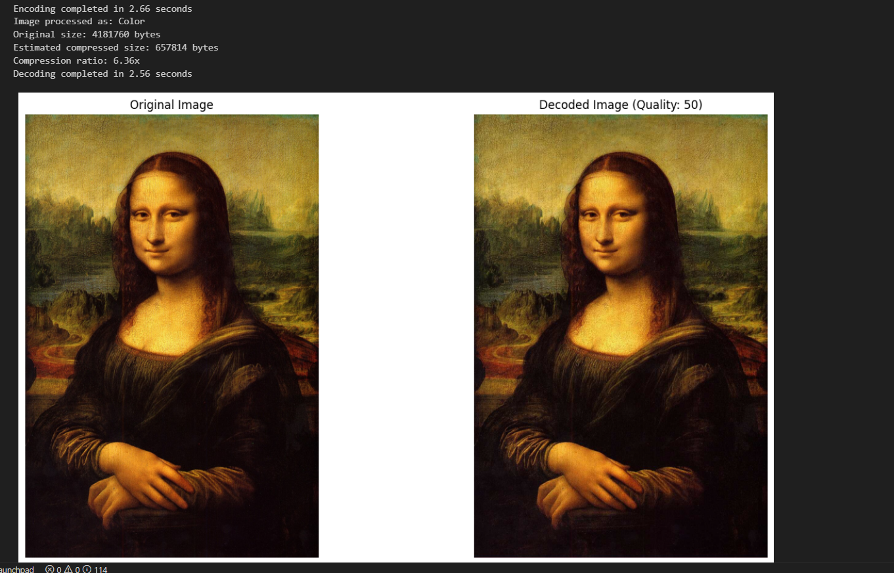

# JPEG Image Compressor & Decompressor (From Scratch)

This repository contains a **complete JPEG image compression and decompression implementation from scratch in Python**, including a user-friendly GUI. The project demonstrates all the core steps of the JPEG standard, without using any built-in image compression libraries for the main algorithm.

---

## Features

- **Full JPEG Pipeline**:
  - RGB to YCbCr color space conversion
  - 4:2:0 chroma subsampling (downsampling and upsampling)
  - 8×8 block splitting and recombination
  - Discrete Cosine Transform (DCT) and Inverse DCT
  - Quantization with adjustable quality (standard JPEG tables)
  - Zig-zag scanning and inverse zig-zag
  - Run Length Encoding (RLE) and decoding
  - Huffman coding and decoding (with DC differential coding)
  - Custom binary file format for compressed data (`.jpgc`)
- **Supports both color and grayscale images**
- **Interactive GUI** (Tkinter):
  - Load, compress, and decompress images
  - Adjustable quality slider (1–100)
  - Force grayscale option
  - Save/load compressed files (`.jpgc`)
  - Save decoded images
  - View original and decompressed images side-by-side
  - Displays compression ratio, PSNR, and file sizes

---

## How It Works

### JPEG Compression Steps

1. **Color Space Conversion**:  
   Converts RGB images to YCbCr, separating luminance (Y) from chrominance (Cb, Cr).

2. **Chroma Subsampling (4:2:0)**:  
   Reduces the resolution of Cb and Cr channels by averaging 2×2 blocks, exploiting the human eye's lower sensitivity to color.

3. **Block Splitting**:  
   Splits each channel into non-overlapping 8×8 blocks, padding as needed.

4. **DCT**:  
   Applies the 2D Discrete Cosine Transform to each block, converting spatial data to frequency coefficients.

5. **Quantization**:  
   Divides DCT coefficients by a quantization table (scaled by quality), rounding to integers. This is the main lossy step.

6. **Zig-Zag Scanning**:  
   Orders the 8×8 block coefficients into a 1D array, grouping low frequencies first, to maximize runs of zeros.

7. **Run Length Encoding (RLE)**:  
   Encodes sequences of zeros efficiently, especially after zig-zag scanning.

8. **Huffman Coding**:  
   Applies variable-length codes to RLE symbols, with shorter codes for more frequent symbols. DC coefficients are differentially coded.

9. **Custom File Format**:  
   All compressed data, quantization tables, Huffman tables, and image metadata are stored in a `.jpgc` binary file.

### Decompression reverses all steps, reconstructing the image.

---

## GUI Usage

### Requirements

- Python 3.7+
- Install dependencies:
  ```
  pip install numpy matplotlib pillow scipy bitarray
  ```

### Running

- **Notebook**:  
  Open and run `Project GUI.py` VS Code.
- **Script**:  
  If exported as `.py`, run:
  ```
  python "Project GUI.py"
  ```

### GUI Features

- **Encode Tab**:
  - Load an image (`.png`, `.jpg`, `.bmp`, etc.)
  - Adjust quality (1–100)
  - Optionally force grayscale compression
  - Click **Encode** to compress
  - View original and decoded images, compression ratio, PSNR
  - Save compressed data (`.jpgc`)
  - Save decoded image

- **Decode Tab**:
  - Load a `.jpgc` file
  - Click **Decode** to decompress and view the image
  - Save the decoded image

---

## File Format (`.jpgc`)

- **Header**: Signature, flags, quality, original shape
- **Quantization Tables**: Luminance and chrominance
- **Huffman Tables**: For each channel
- **Compressed Data**: Huffman-encoded, RLE-compressed DCT coefficients (with DC differential coding)
- **Supports both grayscale and color images**

---

## Example

 <!-- Add your screenshot here -->

---

## Project Structure

- **Notebook**:  
  `Project Notebook.ipynb` — All code, explanations
  `Project GUI.py` — GUI
  
- **Main Classes/Functions**:
  - `JpegCompressionApp`: Tkinter GUI class
  - `jpeg_compress`, `jpeg_decompress`: Universal entry points for compression/decompression
  - `save_encoded_data`, `load_encoded_data`: Custom binary file I/O
  - All JPEG steps as modular functions

---

## Educational Value

- **Step-by-step explanations** in the notebook
- **Visualization** of each JPEG stage (color conversion, DCT, quantization, zig-zag, etc.)
- **No use of built-in JPEG compression** — all logic is implemented from scratch

---

## License

MIT License

---

**Note:**  
This project is for educational and demonstration purposes. For production use, prefer optimized libraries such as [libjpeg](http://libjpeg.sourceforge.net/) or [Pillow](https://python-pillow.org/).
